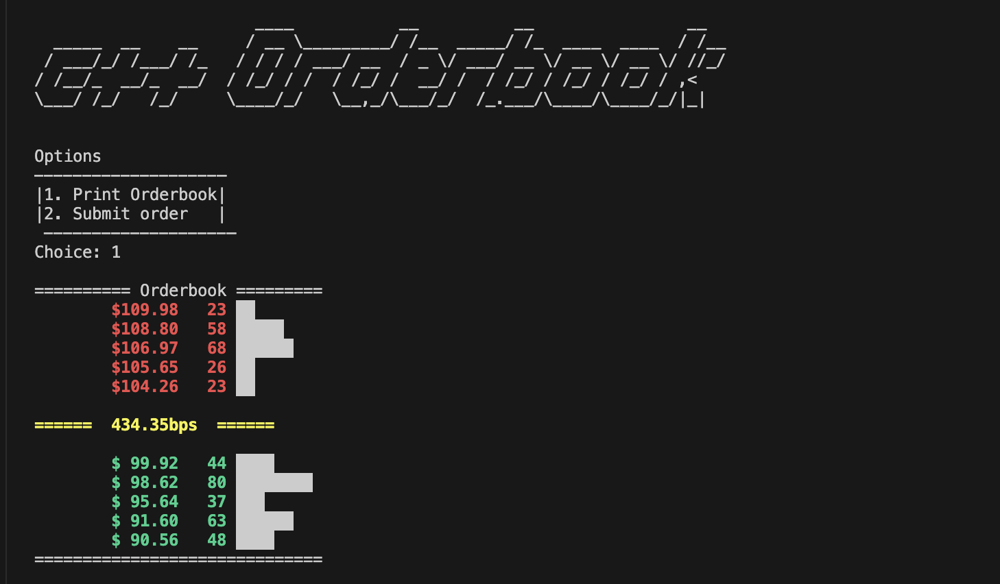
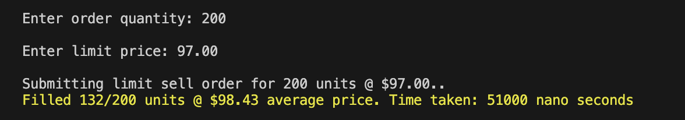
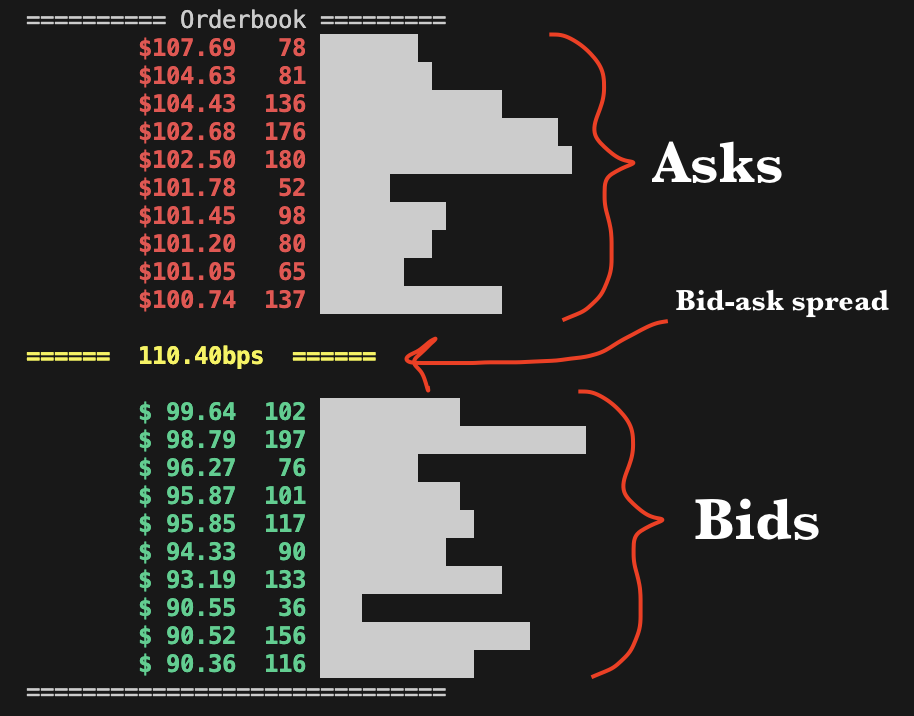

# Orderbook in C++

This C++ project simulates a basic orderbook, a key component in financial trading systems, managing buy and sell orders with a FIFO order matching algorithm. It supports both market and limit orders, handles partial and full fills, and visually represents the state of the orderbook. 

***
## Features

* FIFO queue matching algorithm
* Visualization
* Accepts Market & Limit orders
* Whole and partial fills
* Fast, can execute orders in 4ns
* Unit tests

***
## Demo Video
You can watch a demo of the project in action [here](https://www.youtube.com/watch?v=E2y5wiBO1oE).

***

## Design

The project is designed using Object-Oriented Programming (OOP) principles. It is divided into three main parts:

- `main.cpp`: This is where user interaction is handled. Users can place market or limit orders and the program will process them accordingly.
- `order.hpp`: This file contains the `Order` struct, which represents an order. Each order has properties like price, quantity, and type (market or limit).
- `orderbook.cpp`: This file contains the `Orderbook` class, which manages order objects. It uses a FIFO queue to ensure that orders are processed in the order they are received. It also has logic to execute incoming orders against the book. And finally it has logic to visualize the book.
- `unit_tests.cpp`: This file has unit tests to make sure the orderbook functions as expected.
***

## How to Run

To compile and run the program, follow these steps:

1. Clone the repo: ``https://github.com/engineswap/cpp-orderbook.git``
2. ``cd cpp-orderbook``
3. Compile the program using `make` 
4. Run the program with `./main`
5. (Optional) Run unit tests with `./unit_tests`

***

## Screenshots

A market buy order getting filled

Visualizing the orderbook

***
